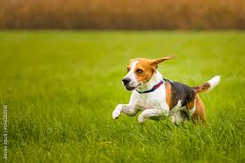
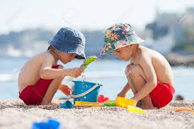

# Image Captioning Generator

This project is an Image Captioning generator that uses a Convolutional Neural Network (CNN) and Long Short-Term Memory (LSTM) model to generate captions for images. The project includes a Jupyter Notebook for training the model and a Streamlit app for generating captions on user-uploaded images.

Try the [Streamlit app!](https://ziadmostafa1-image-description-generator-app-ckk9lv.streamlit.app/)

## Table of Contents
- [Image Captioning App](#image-captioning-app)
  - [Table of Contents](#table-of-contents)
  - [Introduction](#introduction)
  - [Features](#features)
  - [Requirements](#requirements)
  - [Dataset](#dataset)
  - [Model Training](#model-training)
  - [Running the App](#running-the-app)
  - [Usage](#usage)
  - [Results](#results)
    - [Example 1](#example-1)
    - [Example 2](#example-2)

## Introduction
This project demonstrates the use of deep learning techniques for image captioning. The model combines the DenseNet201 architecture for feature extraction from images and an LSTM for generating descriptive captions based on the extracted features.

## Features
- Feature extraction using DenseNet201
- Text processing and tokenization
- Custom data generator for training
- Training with early stopping and learning rate reduction
- Streamlit app for user interaction

## Requirements
- Python 3.6+
- TensorFlow 2.x
- Pandas
- NumPy
- Matplotlib
- Seaborn
- Streamlit
- PIL
- tqdm

## Dataset
The model is trained on the Flickr8k dataset, which contains 8,000 images each with five different captions. The dataset can be downloaded from Kaggle or other sources.

## Model Training
The training process includes:
1. **Image Preprocessing**: Resize and normalize images.
2. **Caption Preprocessing**: Lowercase, remove special characters, and tokenize captions.
3. **Feature Extraction**: Use DenseNet201 to extract features from images.
4. **Data Generation**: Create sequences of image features and corresponding captions.
5. **Model Architecture**: Combine image features and caption sequences using an LSTM model.
6. **Training**: Train the model using the preprocessed data.

## Running the App
To run the Streamlit app:

1. **Clone the repository**:
    ```sh
    git clone https://github.com/zyad-alsharnobi/Image-Description-Generator.git
   cd image-description-generator
    ```

2. **Install the required packages**:
    ```sh
    pip install -r requirements.txt
    ```

2. **Run the app**:
    ```bash
    streamlit run app.py
    ```

This will open a web browser with the application where you can upload images and get captions.

## Usage
1. **Upload an Image**: Click on "Choose an Image" to upload a JPG or PNG image.
2. **View the Caption**: The app will display the image along with the generated caption.

## Results
Here are some sample results from the model:

### Example 1


*Predicted Caption*: a dog runs through the grass

### Example 2


*Predicted Caption*: two children are sitting on bench

The model's performance can be improved by training on larger datasets and using advanced techniques like attention mechanisms.
